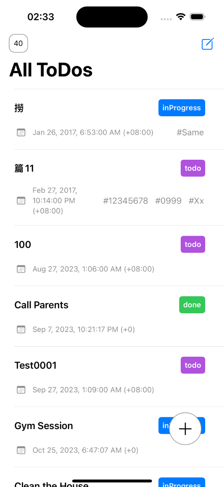
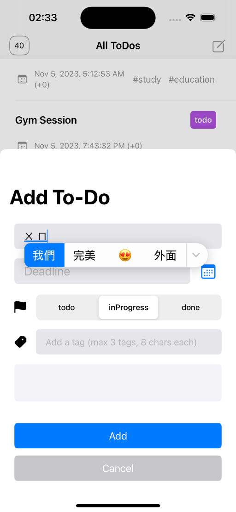
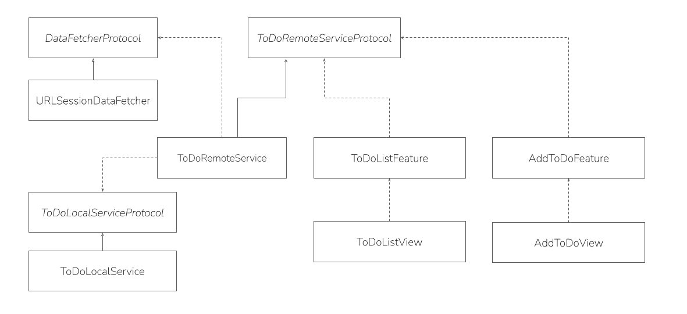

E # ToDoList Application

| ToDoListView                          | AddToDoView                           |
|---------------------------------------|---------------------------------------|
|    |    |

## Video reel
https://www.youtube.com/watch?v=_JOpPdaEeb4 (only open to people who know this link)

## Overview
The ToDoList application is a task management tool built using the Composable Architecture in Swift. This README provides an overview of the main components and their responsibilities within the application.

## Design Patterns

- **The Composable Architecture (TCA)**: Utilizes TCA to manage state and actions predictably, enhancing modularity and testability.
- **Dependency Injection**: Services are injected into features for improved decoupling and easier testing.
- **Protocol-Oriented Programming**: Protocols define service contracts, enhancing flexibility and testability.

## Architecture Overview

The application follows a layered architecture consisting of:
- **User Interface Layer**: 
  Contains views for displaying and adding to-do items.
- **Feature Layer**: 
  Manages state and logic for adding and listing to-do items.
- **Repository / Model Layer**: 
  ToDoLocalService and ToDoRemoteService handle local and remote data operations.
  These services act as repositories by abstracting data access logic, providing a clean API to the Feature Layer.
  This separation of data retrieval and storage from higher-level application logic enables centralized control over data access, 
  enhancing modularity and testability.

## Testing Strategy

Unit tests are implemented for features and services, utilizing mocks and stubs for isolated testing.

## Code Structure and Best Practices

The codebase is organized by features, following consistent naming conventions and coding standards.

## Future Improvements

Potential enhancements include refactoring for better modularity and integrating additional design patterns.

## Commit History

A clear and organized commit history will be maintained to facilitate easy review of changes.

## Main Classes Descriptions

### `AddToDoFeature`
The AddToDoFeature is responsible for managing the state and actions related to adding new to-do items within the application.
- Saving Logic: When the user initiates the save operation, the feature asynchronously updates the isSaving state and handles success or 
  failure responses from the service that posts the new to-do item.
- Error Handling: If saving fails, it updates the saveError property with an appropriate error message, which can be displayed to the user.
- State Management: The feature maintains a structured state that reflects the current status of the to-do item being created, ensuring a seamless and responsive user experience.

### `ToDoListFeature`
Manages the state and actions related to displaying and managing the list of to-do items. Key functionalities include:
- Fetching the list of to-do items.
- Handling the addition and deletion of existing to-do items, always prioritizing remote to-do items. 
  Local items are deleted if their IDs are not found in the remote to-do items.
- Ensure that the new todo item is inserted in the correct position using binary search.
- Managing alerts for error handling and confirmations.

### `DataFetcher`
Defines the protocol for making network requests. It abstracts the process of fetching data, allowing for easier testing and mocking. Key responsibilities include:
- Executing data requests and returning responses or errors.

### `ToDoLocalService`
Responsible for managing local storage (SwiftData) operations related to to-do items. It includes methods for:
- Fetching all to-do items from local storage and sorting them by deadline.
- Saving new or updated to-do items.
- Deleting specified to-do items.

### `ToDoRemoteService`
Handles remote service operations for to-do items. It includes methods for:
- Fetching to-do items from a remote server and sorting them by deadline.
- Posting new to-do items to the server.
- Deleting existing to-do items on the server.

### `ToDoRemoteResponse`
Defines the response structure received from the remote service. It encapsulates the details returned from API calls related to to-do items.

### `ToDoListView`
Most of the design is based on the provided screenshots, with a few differences:
- The trash icon is not displayed directly to avoid accidental clicks; instead, 
  it appears when the user taps a button in the top right corner.
- The text displaying the total number of to-do items could not be placed exactly as per the design; I positioned it above the large title.

### `AddToDoView`
Designed according to the provided mockup, with the following differences:
- The Post API cannot be submitted when the title is empty.
- The title is limited to 32 characters.
- The length of each tag is limited to 8 characters, and the total number of tags cannot exceed 3.
- There is an input field for tags along with a preview view for the tags.
